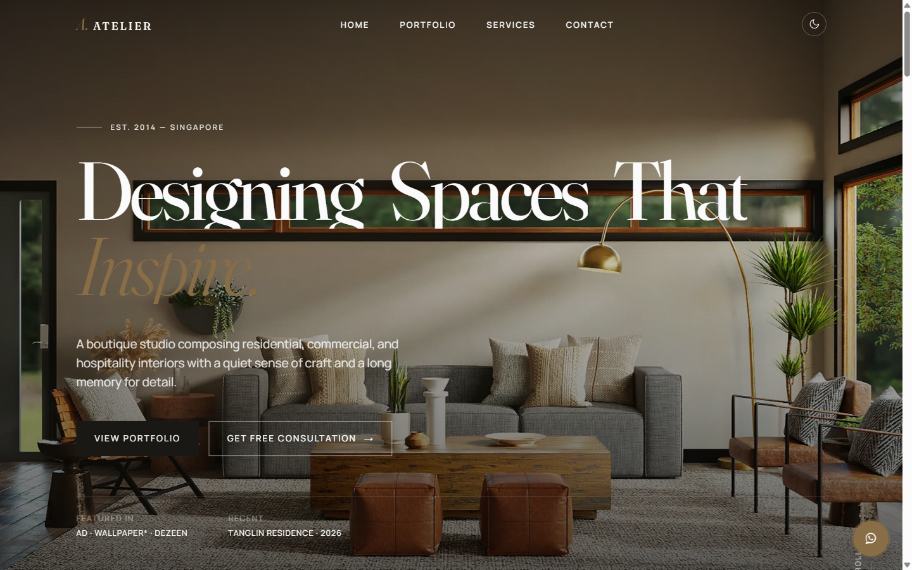

<div align="center">

# SUI·AN 翠庵 — Oriental Zen Interior Studio

[](https://developer.mozilla.org/docs/Web/HTML)
[](https://developer.mozilla.org/docs/Web/CSS)
[](https://developer.mozilla.org/docs/Web/JavaScript)
[](#quick-start)
[](#quick-start)
[](https://fonts.google.com/)
[](https://formsubmit.co/)
[](#accessibility)
[](https://alfredang.github.io/aterlier/)
[](https://github.com/alfredang/aterlier/actions/workflows/deploy.yml)

**A single-page Oriental Zen landing site for a boutique interior studio — wabi-sabi restraint, the breath of *ma*, matcha-green and asagi sky-blue accents, washi paper grain, hand-drawn enso, brush-stroke headlines. Pure HTML, CSS, and vanilla JavaScript. No framework, no build step, no dependencies.**

🌐 **Live demo:** [https://alfredang.github.io/aterlier/](https://alfredang.github.io/aterlier/)



</div>

## About

SUI·AN — 翠庵, the *emerald hermitage* — is a production-grade marketing site for an Oriental Zen interior design studio. The aesthetic is intentionally quiet: **Shippori Mincho** display serif paired with **Noto Sans JP** body and **Klee One** brushwork accents, a matcha-green + asagi sky-blue palette on washi paper, hairline rules instead of boxes, and a single SVG paper-grain overlay. Lacquer accents — cinnabar seal red, kintsugi gold-leaf — appear at most **once** per page, by design.

Built to be **dropped on any static host** (GitHub Pages, Netlify, Cloudflare Pages, S3, a USB stick) — open `index.html` and it works. The enquiry form delivers leads straight to your inbox via FormSubmit with zero backend, and the successful-submit moment plays a Web Speech voice confirmation.

## Key Features

### Zen design system
- **Oriental aesthetic** — Shippori Mincho display + Noto Sans JP body + Klee One for hand-drawn marks; matcha-green primary, asagi sky-blue secondary, washi paper ground
- **Single-use motif rule** — each of `.brush-stroke`, `.enso`, `.kintsugi` seam, `.seal`, and `.kanji-rail` appears **exactly once** per page; the discipline is what makes it read as quiet rather than busy
- **Two themes** — light (washi paper) and dark (sumi ink), toggled and persisted via `localStorage` (key: `atelier-theme`), falls back to `prefers-color-scheme`
- **Design tokens** — every colour, font, spacing step (`--s-1`..`--s-9`), easing and breakpoint flows from CSS custom properties in `:root`
- **Washi paper grain** — fixed inline SVG noise on `body::before`
- **Mobile-first responsive** — fluid type via `clamp()`, breakpoints at 640 / 700 / 900 / 1100 / 1200px

### Motion
- **Hero headline reveal** — word-by-word `wordRise` keyframes with staggered delays (editing the headline requires updating the `.word` spans *and* their `nth-child` delays)
- **Brush-stroke draw** — SVG `stroke-dasharray` countdown on load, ~2.2s to settle
- **Enso open ring** — single hand-drawn circle in the about section, joins `IntersectionObserver` and draws as you scroll in
- **Kintsugi diagonal seam** — gold-leaf hairline near the top of the about section, the page's one metallic moment
- **Scroll-triggered fade + rise** — IntersectionObserver-driven, fires once per element, `data-stagger` ripples siblings
- **Animated stat counters** — `requestAnimationFrame` easeOut from 0 → target
- **`prefers-reduced-motion: reduce`** is respected in both CSS and JS

### Sections
- **Sticky transparent navbar** — solidifies past 80px scroll; mobile hamburger opens a full-screen overlay with vertical kanji numerals (一 二 三 四 五)
- **Hero** — full-viewport background image with mist + overlay, vertical kanji rail (序 / 静), oversized serif headline, brush-stroke divider, dual CTAs
- **About + Stats** — split layout with enso anchor mark, founder signature, four animated counters
- **Practice** — 4-card grid of disciplines (Residential / Hospitality / Spatial Composition / Restoration), each with kanji label
- **Selected Works** — filterable portfolio grid with editorial row spans + keyboard-navigable lightbox (←/→/Esc, cycles only the currently-filtered tiles)
- **Voices** — testimonial carousel, auto-advances every 7s, pauses on hover and tab-hide
- **Begin** — enquiry form with floating-label underline-only inputs, client-side validation, loading state, toast notifications, **Web Speech voice confirmation on success**
- **Footer** — cinnabar kanji seal (the page's one red accent), copyright auto-year
- **Floating WhatsApp** button + **back-to-top** button past 600px scroll

### SEO + standards
- Per-page `<title>`, `meta description`, canonical URL, theme-color
- Open Graph + Twitter Card meta
- **JSON-LD** `InteriorDesignBusiness` schema with full `PostalAddress`
- Semantic landmarks (`<header>`, `<main>`, `<footer>`, `<nav>`)
- Inline SVG favicon (kanji 翠 in matcha on washi — no extra HTTP request)
- Skip-link for keyboard users
- Lazy-loaded portfolio imagery

### Lead capture
- **FormSubmit integration** — `fetch()` POST with JSON body, no backend required
- Hidden honeypot field (`_honey`) to silently drop bot submissions
- Inline per-field validation (name, email regex, optional phone format, message length)
- Success / error toast notifications
- **Web Speech API voice alert** — speaks "HURRAY, YOUR FORM is SUBMITTED SUCCESSFULLY" on successful submission (browsers that support `speechSynthesis`; gracefully silent elsewhere)
- One-time activation email from FormSubmit on first send (industry-standard)

## Tech Stack

| Layer | Choice |
|-------|--------|
| **Markup** | HTML5 — semantic, SEO meta, JSON-LD `InteriorDesignBusiness` |
| **Styling** | CSS3 — custom properties, `clamp()` fluid type, mobile-first |
| **Behaviour** | Vanilla JavaScript (ES2020) — IIFE-per-concern, IntersectionObserver, `fetch`, `speechSynthesis` |
| **Type** | [Shippori Mincho](https://fonts.google.com/specimen/Shippori+Mincho) + [Noto Sans JP](https://fonts.google.com/specimen/Noto+Sans+JP) + [Klee One](https://fonts.google.com/specimen/Klee+One) |
| **Imagery** | Unsplash via URL params — no API key, no rate-limit signup |
| **Forms** | [FormSubmit](https://formsubmit.co/) — no backend, no server, no SMTP config |
| **Hosting** | GitHub Pages via Actions |
| **Build** | None |
| **Bundler** | None |
| **Runtime** | Any modern browser (Chrome / Edge / Safari / Firefox) |

## Architecture

```
┌────────────────────────────────────────────────────────────────────┐
│                          index.html                                │
│   <head>  SEO meta · OG · Twitter · JSON-LD · Shippori+Noto+Klee   │
│   <body>  Nav · Hero · About+Stats · Practice · Works              │
│           Voices · Begin · Footer · WhatsApp · Lightbox            │
└────────────┬──────────────────────────────────┬────────────────────┘
             │                                  │
   ┌─────────▼──────────┐            ┌──────────▼──────────────────┐
   │      style.css     │            │         script.js           │
   │  Tokens (matcha,   │            │   theme · navScroll · menu  │
   │  asagi, washi)     │            │   smoothScroll · reveal     │
   │  Themes · Layout   │            │   counters · portfolioFilter│
   │  Motion · Motifs   │            │   lightbox · carousel       │
   │  Reduced-motion    │            │   enquiry (+voice) · toTop  │
   └────────────────────┘            └──────────┬──────────────────┘
                                                │
                                  ┌─────────────▼──────────────┐
                                  │  https://formsubmit.co/    │
                                  │  ajax/<recipient-email>    │
                                  └────────────────────────────┘
```

## Quick Start

### Prerequisites

A modern browser. That's it.

### Run locally

Either open `index.html` directly, or serve the folder so `fetch()` and Web Speech behave naturally:

```bash
# Python 3
python -m http.server 8000

# Node (any of)
npx serve .
npx http-server .

# PHP
php -S localhost:8000
```

Then visit `http://localhost:8000`.

> **Note on Web Speech.** The voice alert ("HURRAY, YOUR FORM is SUBMITTED SUCCESSFULLY") uses the browser's `speechSynthesis` API. It requires a user gesture (the form submit counts) and a working local TTS voice. If the browser blocks autoplay or has no voice installed, the toast still appears — only the audio is silent.

## Customization

Everything you'd reasonably want to change is in one obvious place.

| Change | Where |
|--------|-------|
| **Lead recipient email** | `script.js` → `ENDPOINT` constant (`https://formsubmit.co/ajax/<email>`) |
| **WhatsApp number** | `index.html` → `<a class="wa-float" href="https://wa.me/<number>">` — country code, no `+`/spaces |
| **Voice alert phrase** | `script.js` → `new SpeechSynthesisUtterance(...)` in the enquiry success branch |
| **Brand name** | `index.html` → `.brand-word` (and footer `.seal` kanji) |
| **Studio address / phone / hours** | `index.html` → `.contact-list` + JSON-LD block in `<head>` |
| **Colour palette + fonts** | `style.css` → `:root` design tokens (matcha, asagi, paper, sumi…) |
| **Hero headline** | `index.html` → `.hero-title .word` spans (update `nth-child` keyframe delays in `style.css` if word count changes) |
| **Portfolio projects** | `index.html` → `#portfolioGrid .tile` figures |
| **Testimonials** | `index.html` → `#carouselTrack .quote` items |
| **Practice disciplines** | `index.html` → `.service-card` articles |

> **FormSubmit activation.** FormSubmit emails a one-time confirmation link to the recipient on the very first submission. Click it once and all future leads deliver silently. Change recipient via `ENDPOINT` only — the displayed `studio@suian.example.com` is a brand placeholder, unrelated to the form delivery address.

## Folder Layout

```
.
├── index.html                      Markup · SEO meta · JSON-LD · inline favicon
├── style.css                       Design tokens · layout · both themes · motifs
├── script.js                       Vanilla JS · IIFE-per-concern · defer-loaded
├── screenshot.png                  Hero screenshot for README
├── CLAUDE.md                       Architecture notes for AI agents
├── README.md                       This file
└── .github/
    └── workflows/
        └── deploy.yml              GitHub Pages deploy on push to main
```

## Deployment

This site deploys to **GitHub Pages via GitHub Actions** on every push to `main`. The workflow at [.github/workflows/deploy.yml](.github/workflows/deploy.yml) uses the official `actions/upload-pages-artifact` → `actions/deploy-pages` flow — no build step, the repo root is uploaded as-is.

To deploy to a different host:

| Host | How |
|------|-----|
| **Netlify** | Drag-and-drop the folder onto [app.netlify.com/drop](https://app.netlify.com/drop) |
| **Cloudflare Pages** | Connect repo, no build command, output `/` |
| **Vercel** | `vercel --prod` from the folder |
| **S3 + CloudFront** | `aws s3 sync . s3://bucket --exclude ".git/*"` |

## Zen Discipline

The aesthetic depends on restraint. A few rules worth knowing before you edit:

- **Single-use motifs.** `.brush-stroke`, `.enso`, `.kintsugi`, `.seal`, `.kanji-rail` each appear once. Adding a second cinnabar or gold-leaf instance breaks the design's quietness — reach for matcha or asagi first.
- **No shadows, no rounded corners** (except circular pills/avatars). Hairlines (`var(--hairline)`) do the work boxes would do.
- **Paper grain stays under z-index 999.**
- **Theme attribute lives on `<html>`**, not `<body>`. Storage key is `atelier-theme` (kept unchanged for back-compat with existing visitors).
- **Floating labels need `placeholder=" "`** (one space) on every input/textarea.
- **Lightbox URL rewrite** — Unsplash sources must preserve the `w=NNN` shape; the lightbox upgrades to `w=1800` via regex.

See [CLAUDE.md](CLAUDE.md) for the full set.

## Accessibility

- Skip-link to main content
- Semantic landmarks (`<header>`, `<main>`, `<footer>`, `<nav>`)
- ARIA labels on icon-only buttons
- `aria-live` on the toast
- Full keyboard nav in the lightbox (←/→/Esc, focus trap on close)
- Visible focus rings via `:focus-visible` (in matcha green)
- Honours `prefers-reduced-motion: reduce`
- Honours `prefers-color-scheme` on first visit
